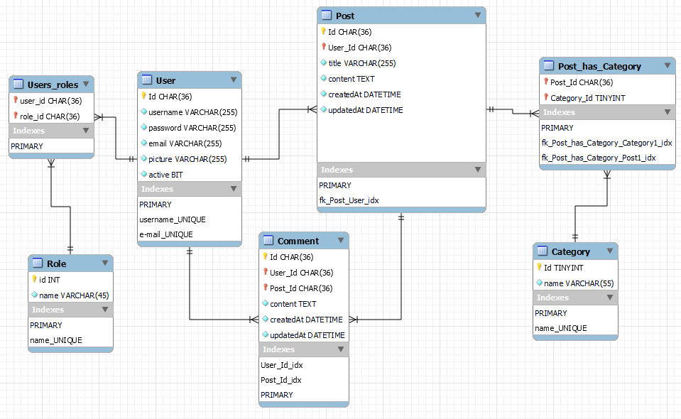

# Programozás módszertana II. beadandó (2022/őszi félév)

## Project description

This is a fullstack blogging system with <b>Spring Boot backend</b> and <b>React.js frontend</b>.

## REST API documentation

Automatically generated by Swagger and it is available on http://localhost:8080/swagger-ui/index.html/

## Features
- Model / Service / Controller / Repository
- JWT Bearer token authentication / authorization
- Register / login user
- CRUD post, upload post picture
- Profile page, upload profile picture
- Search post by title
- USER role and ADMIN role

## Database

